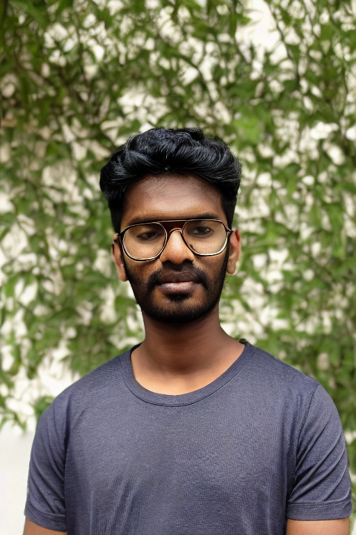
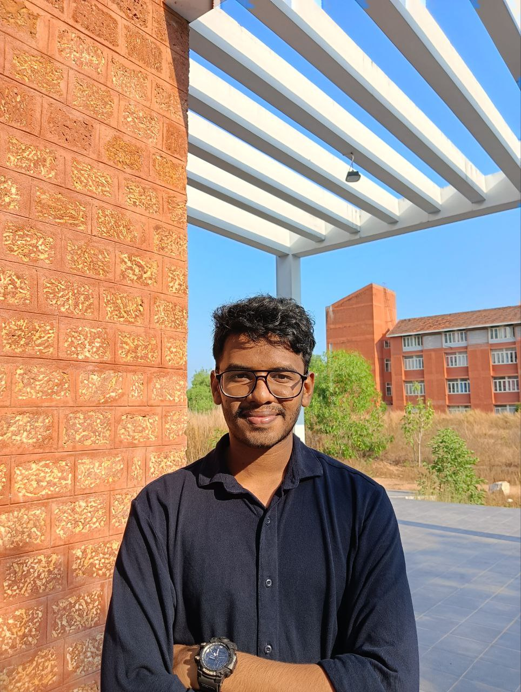
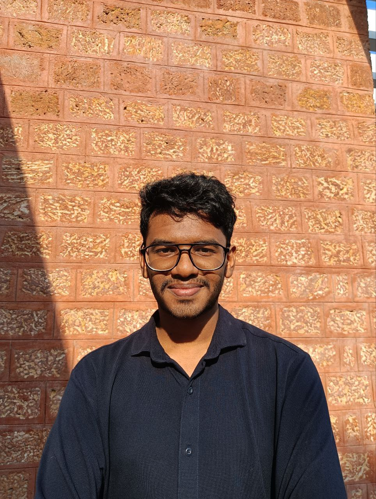
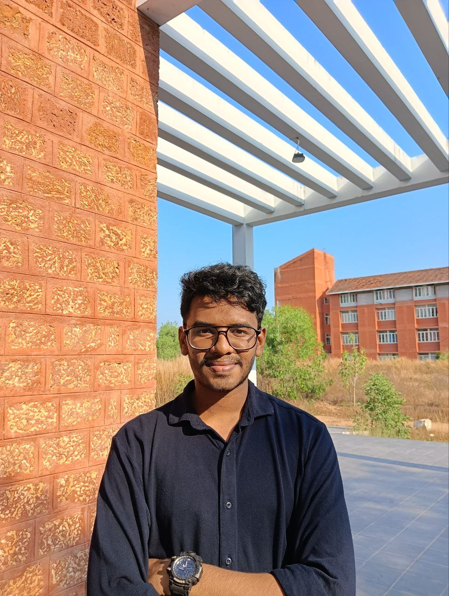

# My First LoRA Fine-Tuning Experiment (Trying to Generate My Own Face!)

## What's This All About?

So this is basically my first attempt at fine-tuning a Stable Diffusion model using **LoRA** to generate images of myself. The whole point was to see if I could teach the model what my face looks like and then generate new photos of me.

But I didn't just want to eyeball it and say "yeah that kinda looks like me" — I actually wanted to measure it with numbers to see how well it really worked.

---

## What I Used

- **Model:** Stable Diffusion v1.5  
- **Source:** runwayml/stable-diffusion-v1-5  
- **Framework:** Hugging Face Diffusers  
- **Hardware:** RTX 3050 (6GB VRAM) — yeah, working with what I got!

---

## The Training Data

I basically grabbed around **30 photos** of myself with:
  - Different lighting conditions
  - Various angles
  - Different facial expressions

Just threw them all in a folder, nothing fancy.

**Folder structure looked like this:**

```
lora_dataset/aravind/
├── img001.jpg
├── img002.jpg
├── img003.jpg
└── ...
```

---

## Training Setup

Here's what I went with for the LoRA training:

- **Training method:** LoRA (Low-Rank Adaptation)
- **Resolution:** 512 × 512
- **Batch size:** 1 (my GPU isn't exactly a beast lol)
- **Rank:** 8
- **Mixed precision:** FP16
- **Optimizer:** Just used the default Diffusers setup
- **Seed:** Kept it fixed so I could actually compare results

---

## The Experiments

I trained the same dataset multiple times with different epochs to see what works best:

- **exp_e10** → 10 epochs  
- **exp_e20** → 20 epochs  
- **exp_e30** → 30 epochs  
- **exp_e40** → 40 epochs  
- **exp_e50** → 50 epochs  

Each one gave me a different LoRA weights file (`.safetensors`).

---

## Generating Images

For each trained model:

- Used the **exact same prompt** every time
- Used the **same seed (1236)** for fair comparison
- Generated portrait-style images (512 × 768)

**My folder setup:**

```
generated_images/
├── exp_e10/
├── exp_e20/
├── exp_e30/
├── exp_e40/
└── exp_e50/
```

I'm just showing one image from each experiment here for comparison.  
The full batch results are in the numbers table below.

---
## Generated Results

All these images were made with the **same prompt and same seed (1236)** so you can actually compare them fairly.

<table>
  <tr>
    <th>10 Epochs</th>
    <th>20 Epochs</th>
    <th>30 Epochs</th>
    <th>40 Epochs</th>
    <th>50 Epochs</th>
  </tr>
  <tr>
    <td align="center">
      
    </td>
    <td align="center">
      
    </td>
    <td align="center">
      
    </td>
    <td align="center">
      
    </td>
    <td align="center">
      
    </td>
  </tr>
</table>

---

## My Training Photos (Just Some Samples)

Here are a few of the actual photos I used to train the model.  
You can see they've got different lighting, angles, and expressions.

<table>
  <tr>
    <td align="center">
      
    </td>
    <td align="center">
      
    </td>
    <td align="center">
      
    </td>
    <td align="center">
      
    </td>
    <td align="center">
      
    </td>
  </tr>
</table>

---

## The Prompt I Used

Here's what I used to generate all the images:

```python
# My prompt - tried to be really specific about facial features
prompt = (
    "portrait photo of <aravind-person>, "
    "same facial structure, same jawline, same eye spacing, same nose shape, "
    "realistic skin texture, "
    "DSLR photo, 85mm lens, natural lighting"
)

# Negative prompt to avoid weird artifacts
negative_prompt = (
    "cartoon, anime, illustration, painting, blurry, "
    "distorted face, extra fingers, bad anatomy, bad eyes"
)
```

---

## Why I Didn't Just Trust My Eyes

Looking at images and saying "yeah that's me" is super subjective, right?

Even though Stable Diffusion works in this thing called latent space, **faces aren't really separated out in a way that makes them easy to compare** there. So just comparing the latent outputs wouldn't really tell me if the face looks like me.

Instead, I used a **face recognition model** to get actual numbers. Way more objective.

---

## How I Measured Face Similarity

### The Model

- **ArcFace** — it's a pretty popular face recognition model used in real verification systems

### The Metric

- **Cosine similarity**  
- **Range:** 0 to 1  
  - Higher number = faces are more similar

---

## How I Actually Evaluated It

Just using one random seed wouldn't be fair, so I did a **batch evaluation**:

**Here's what I did:**

1. Generated **10 images for each experiment**
2. For each generated image:
   - Compared it with all my real photos
   - Kept the highest similarity score
3. Then looked at the batch stats:
   - Average similarity
   - Minimum similarity
   - Maximum similarity

This gives a much better idea of how well it's actually working.

---

## The Results

| Experiment | Avg Similarity | Min   | Max   |
|------------|----------------|-------|-------|
| exp_e10    | 0.459          | 0.394 | 0.551 |
| exp_e20    | 0.466          | 0.360 | 0.592 |
| exp_e30    | 0.421          | 0.194 | 0.569 |
| exp_e40    | 0.510          | 0.223 | 0.978 |
| exp_e50    | **0.573**      | 0.373 | 0.703 |

Best results were around **30-50 epochs**.

---

## What I Learned

- Not enough training → the model doesn't really learn my face
- Too much training → things start getting weird and distorted
- Some random seeds just work way better than others
- LoRA doesn't copy your face exactly — it learns patterns
- The model can still make stuff up because of:
  - How random generation works
  - What's in the prompt
  - Limited training photos

---

## Bottom Line

- LoRA can kinda preserve facial identity, but it's not perfect
- Using ArcFace with cosine similarity gave me solid numbers to work with
- Sweet spot was around **30–50 epochs**
- Numbers + eyeballing = best way to evaluate

---

## Just So You Know

- This is purely for learning and research
- Not trying to impersonate anyone or do anything shady
- The evaluation methods I used are pretty standard in the industry

---

## A Personal Note

I know these images don't really look like me... lol. But honestly, I know what I can do to make it better! This result was what I expected with just 30 images and 50 epochs, and I genuinely learned a ton while doing this project. It was my first time doing something like this after my research in deepfake video detection. 

Thanks so much for checking this out! 🙏

---

## License

This project is for educational and research purposes only.


